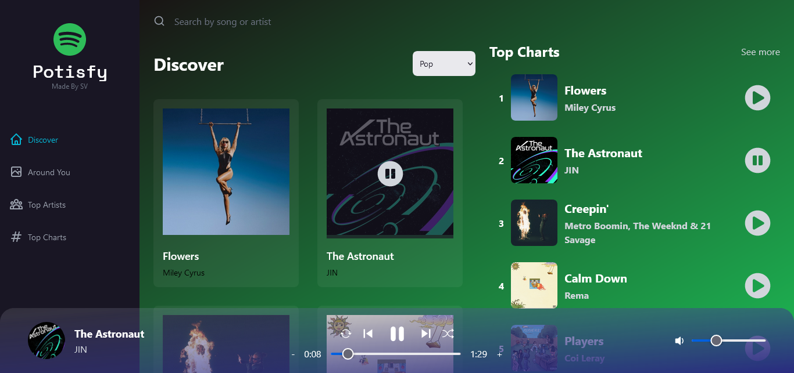
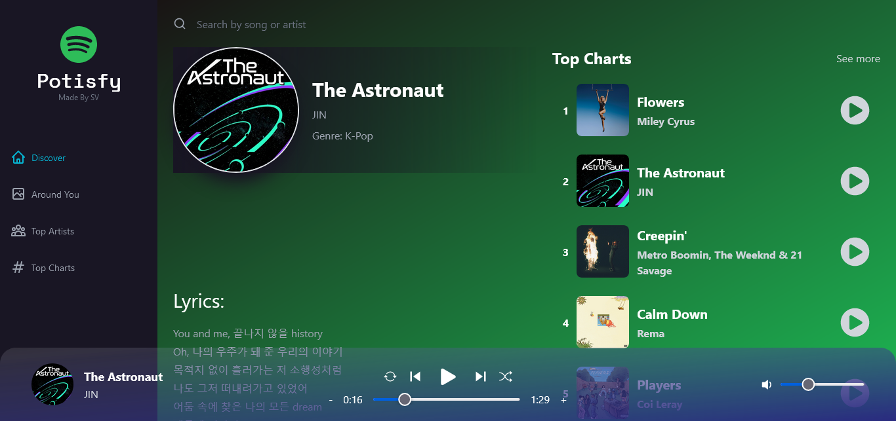
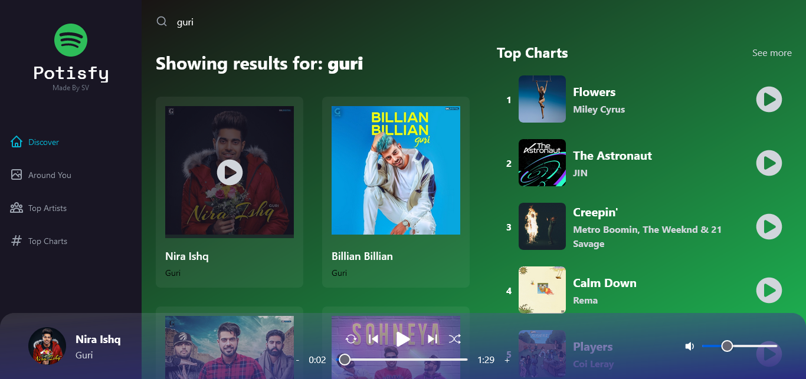
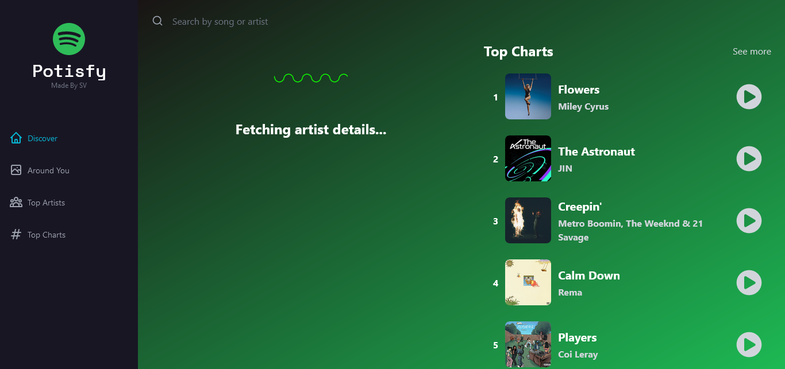

  
  <h1 align="center">Potisfy - A Spotify Clone built with React. </h1>

<h2 align="center">Potisfy Discover Page</h2>

 

<h2 align="center">Potisfy Lyrics Page</h2>

  

<h2 align="center">Potisfy Search Page</h2>

  

<h2 align="center">Potisfy Loader</h2>

  

<h1 align="center">About The Project</h1>  

A Spotify clone built with React, Tailwind CSS, Vite, Rapid API, Redux Toolkit and RTK Query. The project is focused on leveraging the Rapid APIs into the application and by using caching through RTK query to fetch duplicate queries to optimize the loading times within the nested components.

## Features

- [x] Fetch Top Charts
- [x] Fetch Top Artists
- [x] Lyrics
- [x] Caching Fetched API queries
- [x] Vite production build
- [x] Search songs by song names or singer
- [x] Geo Locate Songs by country - No Endpoints from source API
